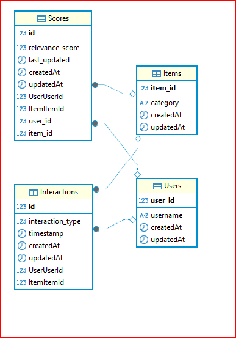

# AI Product Recommendation

Sistema completo de recomendação de produtos baseado em inteligência artificial, composto por uma API backend, um frontend interativo, um serviço de recomendação e um banco de dados.

## Índice

- [Visão Geral](#visão-geral)
- [Arquitetura](#arquitetura)
- [Serviços](#serviços)
  - [API Backend (`api/`)](#api-backend-api)
  - [Frontend (`front/`)](#frontend-front)
  - [Serviço de Recomendação (`recommender_service_ai/`)](#serviço-de-recomendação-recommender_service_ai)
  - [Banco de Dados (`db/`)](#banco-de-dados-db)
- [Instalação](#instalação)
- [Uso](#uso)
  - [Endpoints da API](#endpoints-da-api)
  - [Atualizar Recomendações](#atualizar-recomendações)
- [Tecnologias Utilizadas](#tecnologias-utilizadas)
- [Licença](#licença)

## Visão Geral

Este projeto tem como objetivo fornecer recomendações personalizadas de produtos para usuários, utilizando técnicas de inteligência artificial. A aplicação é composta por múltiplos serviços que trabalham em conjunto para coletar dados, processar informações e apresentar recomendações relevantes.

## Arquitetura

A arquitetura do sistema é baseada em microsserviços, com os seguintes componentes principais:

- **API Backend**: Responsável por gerenciar as requisições dos usuários e intermediar a comunicação entre o frontend e os serviços internos.
- **Frontend**: Interface gráfica que permite aos usuários interagir com o sistema e visualizar as recomendações.
- **Serviço de Recomendação**: Processa os dados dos usuários e produtos para gerar recomendações personalizadas.
- **Banco de Dados**: Armazena informações sobre usuários, produtos e interações.

A comunicação entre os serviços é facilitada pelo uso do Docker e do Docker Compose, que orquestram os containers de cada componente.

## Serviços

### API Backend (`api/`)

A API Backend é desenvolvida em [Node.js](https://nodejs.org/) e utiliza o framework [Express](https://expressjs.com/) para gerenciar as rotas e requisições HTTP. Ela serve como ponto central de comunicação entre o frontend e os demais serviços.

**Principais funcionalidades:**

- Receber requisições do frontend.
- Comunicar-se com o serviço de recomendação para obter sugestões de produtos.
- Interagir com o banco de dados para armazenar e recuperar informações.

### Frontend (`front/`)

O Frontend é desenvolvido com [React](https://reactjs.org/) e serve para exibir a interface interativa onde os usuários podem visualizar produtos e recomendações personalizadas.

### Serviço de Recomendação (`recommender_service_ai/`)

O Serviço de Recomendação é desenvolvido em [Python](https://www.python.org/) e utiliza técnicas de inteligência artificial, com o apoio de bibliotecas como [PyTorch](https://pytorch.org/) para treinar e aplicar modelos de recomendação baseados nas interações dos usuários e produtos.

### Banco de Dados (`db/`)

O banco de dados armazena dados essenciais para o funcionamento do sistema, como usuários, produtos, interações e pontuações de relevância. É possível utilizar tanto [Json-Server](https://www.npmjs.com/package/json-server) quanto [PostgreSQL](https://www.postgresql.org/), dependendo das preferências do usuário para armazenamento.

## Arquitetura `Postgres`


## Instalação

Para executar o projeto localmente, siga os passos abaixo:

1. **Clone o repositório:**

   ```bash
   git clone https://github.com/leonardoigor/ai_product_recommendation.git
   cd ai_product_recommendation
